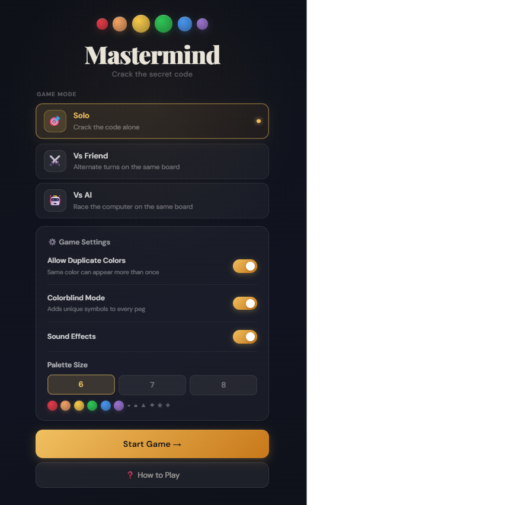
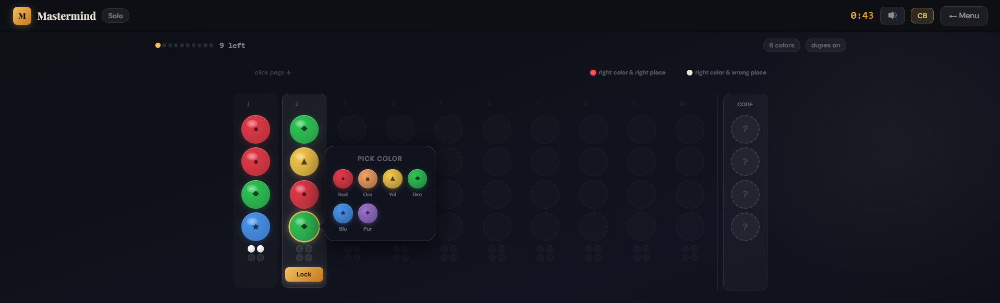
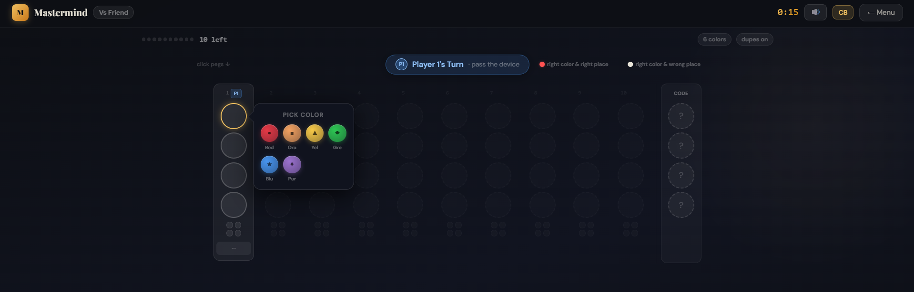
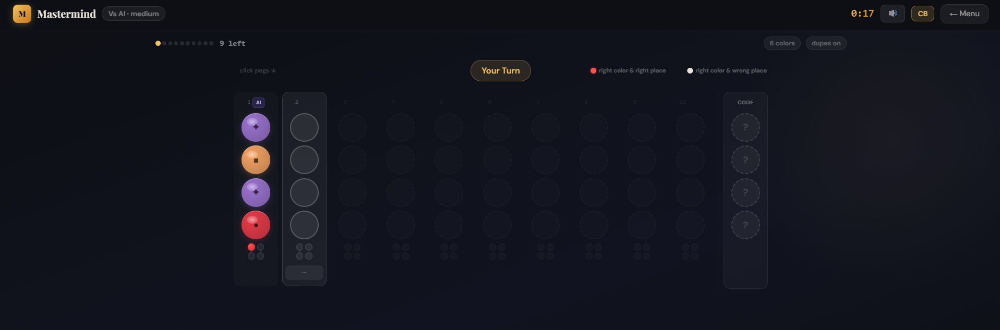
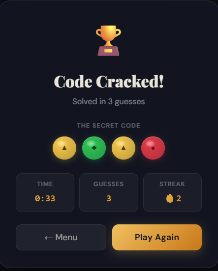
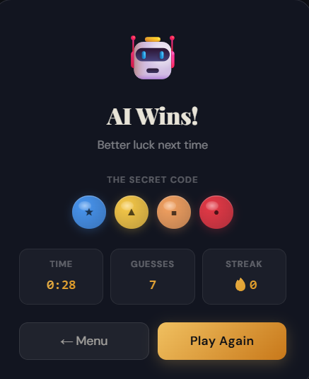

# Mastermind

A fully-featured, browser-based implementation of the classic **Mastermind** code-breaking puzzle, built with React 18 and Vite. The app supports three game modes: Solo, Vs Friend (local pass-and-play), and Vs AI (with three AI difficulty levels) a shared horizontal game board, configurable game settings, colorblind accessibility, Web Audio sound effects, and a polished dark UI with smooth animated transitions.

### Website Link: https://mastermind-zmci.onrender.com/
---

## 📋 Table of Contents

- [Screenshots](#-screenshots)
- [Features](#-features)
- [Game Modes](#-game-modes)
- [How to Play](#-how-to-play)
- [AI Difficulty Levels](#-ai-difficulty-levels)
- [Game Settings](#-game-settings)
- [Tech Stack](#-tech-stack)
- [Getting Started](#-getting-started)
- [Architecture & Design Decisions](#-architecture--design-decisions)

---

## 📸 Screenshots

| Home Screen | Solo Game | Vs Friend |
|:-----------:|:---------:|:---------:|
|  |  |  |

| Vs AI | Game Over — Win | Game Over — Loss |
|:-----:|:---------------:|:----------------:|
|  |  |  |

---

## ✨ Features

- **Three game modes** — Solo, local 2-player pass-and-play, and Vs AI
- **Three AI difficulty levels** — Easy (random), Medium (heuristic filtering), Hard (Knuth's minimax algorithm, guaranteed ≤5 guesses)
- **Shared horizontal board** — all players and the AI guess on the same board in chronological order; 10 total guesses per game
- **Configurable palette** — choose 6, 7, or 8 colors from a set of 8 distinct options
- **Duplicate colors toggle** — allow or prevent the same color from appearing more than once in the secret code
- **Colorblind mode** — overlays a unique geometric symbol (●■▲◆★✦✿⬟) on every peg so colors can be identified by shape alone
- **Web Audio API sound effects** — synthesized audio cues for peg placement, guess submission, feedback pegs, wins, and losses, with zero external audio files
- **Per-game timer** — elapsed time tracked and displayed live in the navigation bar
- **Session statistics** — tracks wins, losses, best solve (fewest guesses), current win streak, and best streak across games
- **Animated turn transitions** — a spring-pop badge animates when the active player changes
- **Result modal** — shows the secret code, final stats, time, and options to play again or return to the menu
- **Dark luxury UI** — deep navy background, jewel-tone pegs with radial-gradient shading and specular highlights, gold accent colors, smooth CSS transitions throughout
- **Persistent settings** — game preferences (duplicates, color count, sound, colorblind mode) saved to `localStorage` via Zustand's `persist` middleware

---

## 🕹 Game Modes

### 🎯 Solo
The app generates a random secret code. You have **10 guesses** to crack it. After each guess, red and white feedback dots tell you how close you are. The timer starts immediately. Your result (solved/failed, guesses used, time) is shown at the end with options to play again or return to the menu.

### ⚔️ Vs Friend (Local Pass-and-Play)
Both players share the same device and the same randomly generated secret code. Players **alternate turns** on the shared board — Player 1 guesses, then Player 2, and so on. A turn-change badge animates each time the active player changes, signalling the other player to take over. Whoever cracks the code first wins. If neither player solves it within the 10 shared guesses, neither wins. The result screen shows each player's solve turn count for comparison.

**Who goes first** is configurable on the home screen — Random (coin flip), Player 1, or Player 2.

### 🤖 Vs AI
You and the AI share the same board and take turns guessing the same secret code. The AI goes first by default. You each see one another's guesses and feedback on the shared board. Whoever solves the code in fewer guesses wins. The AI uses the feedback from **all guesses on the board** — including yours — to narrow its candidate pool on Medium and Hard, so your good guesses help it and your poor guesses do too.

---

## 📖 How to Play

### Objective
Crack the hidden 4-color code before the 10 shared guesses run out.

### Making a Guess
1. Click any empty peg slot on the active column — a color picker pops up to the right.
2. Select a color. Repeat for all 4 slots in the column.
3. Press **Lock** to submit your guess.

### Reading the Feedback
After each guess, you receive up to 4 feedback dots in a 2×2 grid on the right side of that column:

| Dot | Meaning |
|-----|---------|
| 🔴 **Red** | There is a correct color in the correct position |
| ⚪ **White** | There is a correct color but in the wrong position |
| ⬤ **Empty** | This color does not appear in the code at all |

> **Important:** The dots only tell you *counts* — they do not correspond to specific peg positions. Two red dots means two pegs are exactly right, but it does not tell you which two.

### Winning and Losing
- **Win** — all 4 feedback dots are red (every peg is correct)
- **Loss** — the 10 shared guesses are used up without anyone solving the code
- In **Vs Friend** and **Vs AI**, whoever solves it first (fewest guesses) wins

### Tips
- Start with 4 different colors to get the maximum amount of information from your first guess.
- A red dot means that slot is confirmed — don't change it on your next guess.
- A white dot means the color belongs in the code but needs to be repositioned.
- No dots at all means none of those colors are in the code — eliminate them entirely.
- In Vs Friend and Vs AI, study your opponent's feedback rows — they reveal information about the code that you can use.

---

## 🤖 AI Difficulty Levels

### Easy
Picks completely randomly from all possible codes on every turn. It ignores all feedback from previous guesses (its own and yours) entirely. Expect it to take the full 10 guesses or more.

### Medium
After each guess, the AI filters out all codes that are **inconsistent with the feedback received so far** — both from its own guesses and from yours. It then picks randomly from the remaining valid candidates. This is significantly smarter than Easy but has no guarantee on worst-case performance.

### Hard — Knuth's Minimax Algorithm
Implements **Knuth's Five-Guess Algorithm**, which guarantees cracking any 4-peg, 6-color code in **5 guesses or fewer**. The algorithm works by choosing the guess that, in the worst case, eliminates the most remaining candidates — a minimax strategy over the information gain across all possible feedback responses.

- On the first move, a randomized opening guess from a set of varied two-pair permutations is played (e.g., RRBB, GGRR, RGRG, etc.) for variety across games.
- On subsequent moves, the AI evaluates every candidate guess against the full pool, scores each by its worst-case remaining pool size, and picks the guess with the minimum worst case. When multiple guesses are tied, it prefers guesses that are also valid solutions (still in the pool), then picks randomly among them.
- The AI uses feedback from **all rows on the board** (human and AI alike) when filtering its candidate pool, meaning it implicitly benefits from your guesses.

---

## 🔧 Game Settings

All settings are accessible from the home screen and persist across sessions via `localStorage`.

| Setting | Default | Description |
|---------|---------|-------------|
| **Allow Duplicate Colors** | On | When on, the same color can appear more than once in the secret code (e.g., Red-Red-Blue-Green). When off, all 4 pegs are distinct colors. |
| **Colorblind Mode** | Off | Adds a unique symbol to every colored peg — ●■▲◆★✦✿⬟ — so colors can be distinguished by shape, not hue. |
| **Sound Effects** | On | Synthesized audio cues via the Web Audio API. Includes peg placement clicks, guess submission chimes, red/white peg sounds, win fanfare, and loss tones. No audio files are downloaded. |
| **Palette Size** | 6 | The number of distinct colors available. 6, 7, or 8 colors from the full palette of Red, Orange, Yellow, Green, Blue, Purple, Pink, Teal. More colors = more possible codes = harder. |

### Code Space Reference

| Colors | Duplicates On | Duplicates Off |
|--------|---------------|----------------|
| 6 | 1,296 possible codes | 360 possible codes |
| 7 | 2,401 possible codes | 840 possible codes |
| 8 | 4,096 possible codes | 1,680 possible codes |

---

## 🛠 Tech Stack

| Technology | Version | Purpose |
|------------|---------|---------|
| **React** | 18.2 | UI framework — functional components and hooks throughout |
| **Vite** | 5.1 | Build tool and dev server — fast HMR, ES module native |
| **React Router** | 6.22 | Client-side routing (Home → Game) |
| **Zustand** | 4.5 | Global state management for game state and settings |
| **Framer Motion** | 11 | Declarative animations (imported but the primary animations use CSS keyframes) |
| **canvas-confetti** | 1.9 | Confetti burst on win |
| **Tailwind CSS** | 3.4 | Utility CSS framework — used in `HomePage.jsx` for layout |
| **Web Audio API** | Native | Synthesized sound effects — no external audio files |
| **PostCSS / Autoprefixer** | — | CSS processing and vendor prefix handling |

All game logic — code generation, guess evaluation, AI strategy — is implemented in pure JavaScript with no external dependencies.

## 🚀 Getting Started

### Prerequisites
- **Node.js** v18 or higher
- **npm** v9 or higher (comes with Node.js)

### Installation

```bash
# 1. Clone the repository
git clone https://github.com/your-username/mastermind.git
cd mastermind

# 2. Install dependencies
npm install

# 3. Start the development server
npm run dev
```

The app will be available at **http://localhost:5173** by default.

### Available Scripts

| Command | Description |
|---------|-------------|
| `npm run dev` | Start development server with hot module replacement |
| `npm run build` | Build for production — outputs to `dist/` |
| `npm run preview` | Serve the production build locally for testing |

### Production Build

```bash
npm run build
# Output in dist/ — serve with any static file host (Netlify, Vercel, GitHub Pages, etc.)
```

No environment variables or server configuration is required. The built `dist/` folder is fully self-contained and can be hosted on any static file host.

---

## 🏗 Architecture & Design Decisions

### State Management
All mutable game state lives in a single Zustand store (`useGame`). The store is split into two logical pieces:

- **`useSettings`** — persisted to `localStorage`. Holds user preferences (color count, duplicates toggle, sound, colorblind mode) that survive page refreshes.
- **`useGame`** — ephemeral game state. Holds the secret code, all guesses (tagged by player), current guess being built, turn tracking, timer, AI candidate pool, and session statistics.

Having all game state in one place (rather than distributed across component state) means the `GamePage` simply reads from the store and dispatches actions — no prop drilling, no context providers.

### Shared Board Model
All three game modes use the **same data structure**: a single flat `guesses` array where each entry records `{ pegs, feedback, player }`. In Solo mode, all entries have `player: 1`. In Vs Friend and Vs AI, entries alternate between `player: 1` and `player: 2`. The board renders all entries chronologically left to right, with player badges distinguishing whose guess is whose. The total is capped at `MAX_GUESSES = 10` across all players combined.

This model means the 10-guess limit is inherently shared — there is no separate per-player counter to go out of sync.

### Guess Evaluation Algorithm
The `evaluateGuess(secret, guess)` function correctly handles duplicate colors using frequency counting:

1. Scan left to right — exact position matches are counted as **blacks** (shown as red dots).
2. The remaining unmatched pegs in both secret and guess are compared by color frequency — matches on color (wrong position) are counted as **whites**.
3. A color in the guess is never double-counted, even if it appears in the secret multiple times.

### AI Architecture
The AI always guesses from the same candidate pool that is filtered by the feedback of **every guess on the board**, not just its own. This means on Medium and Hard, the AI implicitly uses the human player's guesses to narrow the solution space — making it a true shared-information opponent.

- **Easy** — `O(1)` per turn. Picks randomly from the full code space. No learning.
- **Medium** — `O(P)` per turn where P is the remaining pool size. Filters pool after each turn, picks randomly from survivors.
- **Hard** — `O(P × C)` per turn where P is pool size and C is candidate count (≤1,296 for 6 colors). Full minimax evaluation on every turn.

### Sound Design
All audio is generated procedurally via the Web Audio API (`soundManager.js`). Oscillators (sine, triangle, sawtooth, square) are created on demand and discarded after playback — no audio files are bundled with the app. The `AudioContext` is created lazily on first user interaction to comply with browser autoplay policies.

### UI / Visual Design
The visual design follows a **dark luxury** aesthetic: deep navy (`#0d0f14`) background, jewel-tone colored pegs rendered with radial gradients and a specular highlight highlight ellipse, gold (`#f0c060` → `#c8781a`) accents for interactive elements, and subtle glassmorphism on panel surfaces. Feedback dots are **red** (exact match) and **white** (color present, wrong position) — a deliberate departure from the classic black/white to improve contrast on dark backgrounds.

The board is **horizontal** — each guess is a vertical column, columns read left to right, and the secret code column is pinned to the right end. This orientation matches the physical Mastermind board and makes the progression of guesses naturally readable as a timeline.

Include **Colorblind Mode** where every peg displays a distinct geometric symbol (●■▲◆★✦✿⬟) in addition to its color.

---
